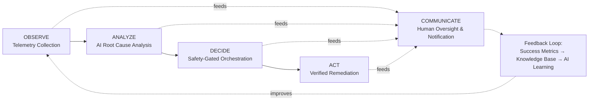
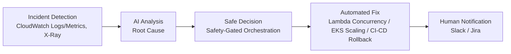
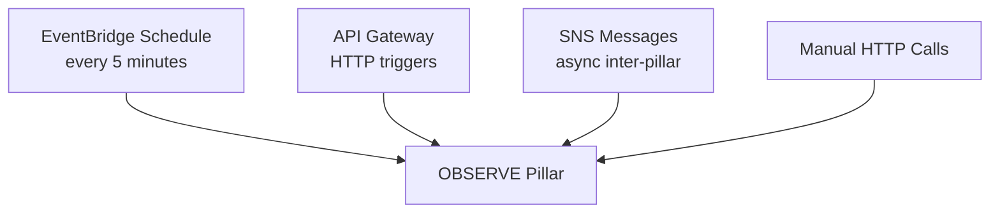
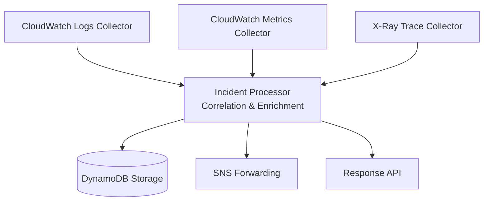
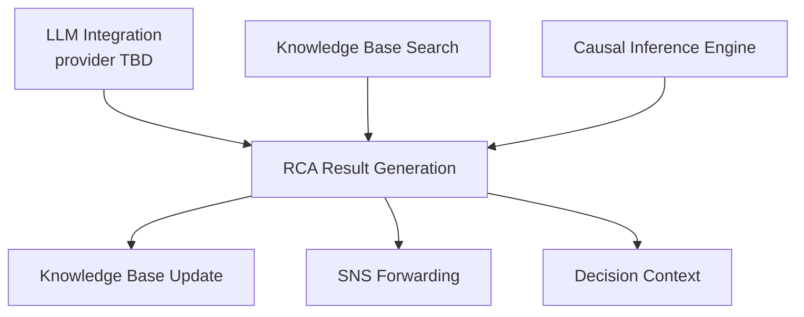
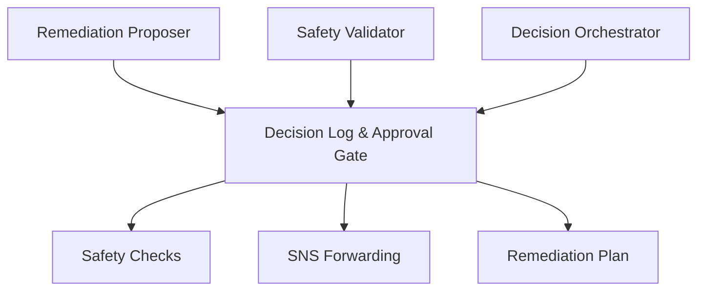
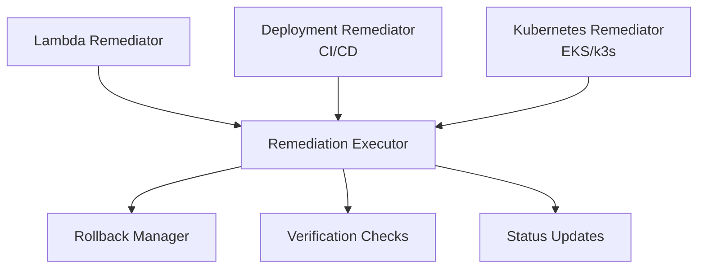
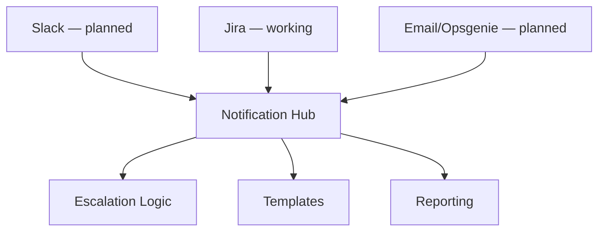
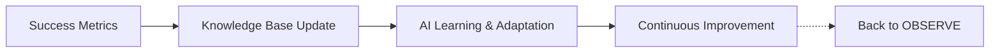
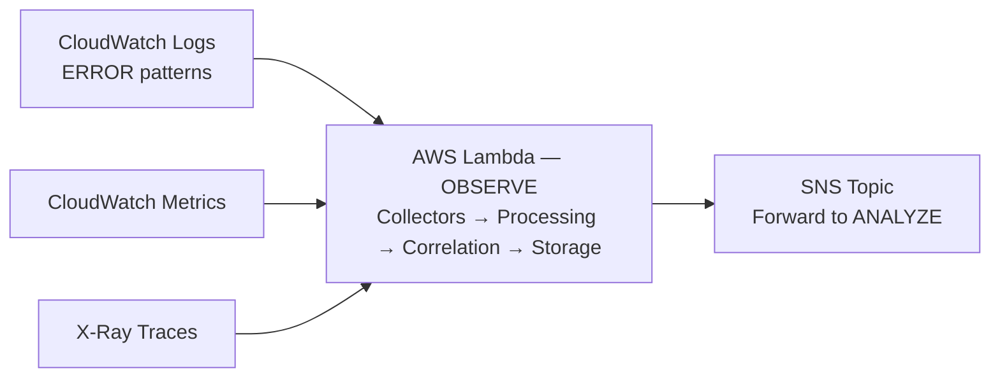

# AI-Native Self-Healing DevOps Platform — Complete Implementation Guide

---

## 🌟 Project Vision & Introduction

### The Problem We're Solving

In today's cloud-native world, DevOps teams are drowning in alerts.
Traditional monitoring tools generate thousands of notifications daily,
but most are false positives or require manual investigation. Critical
incidents often go undetected until they impact customers, while routine
issues consume valuable engineering time.

**Current Reality:**
- 🚨 **Alert Fatigue:** Teams receive 1000+ alerts/day, most are noise
- ⏰ **Slow Response:** Average MTTR (Mean Time To Resolution) is 4-24 hours
- 💰 **High Costs:** Manual incident response is one of the largest hidden
  ongoing costs in engineering teams
- 🎯 **Reactive Approach:** Teams fight fires instead of preventing them

### Our Solution: AI-Native Self-Healing DevOps

This project builds an autonomous DevOps platform that implements the
**OODA Loop** (Observe, Orient/Analyze, Decide, Act) to create a
self-healing infrastructure ecosystem, entirely on AWS.

**What This Means:**
- 🤖 **Zero-Touch Operations:** Incidents are detected, diagnosed, and
  resolved automatically wherever it's safe to do so
- ⚡ **Fast Response:** MTTR reduced from hours to minutes
- 🎯 **Predictive Intelligence:** Catch incidents trending toward failure
  before they fully occur
- 📈 **High Uptime:** Continuous detection and self-healing
- 💰 **Cost Reduction:** Minimize manual intervention and downtime

---

## 🏗️ Complete Project Architecture & Flow

### The OODA Loop: Our Operational Foundation

This platform implements the military-proven OODA Loop — the
decision-making cycle that enables rapid, effective responses to
changing conditions.



**End-to-End Incident Resolution Flow**



### Data Flow Through the Platform

**External Triggers**


**OBSERVE Pillar**


**ANALYZE Pillar** *(in progress)*


**DECIDE Pillar** *(planned)*


**ACT Pillar** *(planned)*


**COMMUNICATE Pillar** *(partially built)*


**Feedback Loop**


### OBSERVE Pillar Collector Responsibilities

**CloudWatch Logs Collector:** Continuously scans every log group in the
account for error-severity events, without needing to know which log
groups exist in advance — discovery is dynamic, via
`logs:DescribeLogGroups`. Filters ERROR-pattern lines, extracts
correlated metadata, and identifies log-driven incidents across whatever
services are actually deployed.

**CloudWatch Metrics Collector:** Discovers every resource currently
reporting each tracked metric via `cloudwatch:ListMetrics` — Lambda
Duration/Errors/Throttles/Invocations/ConcurrentExecutions, API Gateway
Latency/5XXError, DynamoDB capacity/throttling, SQS queue depth, and EC2
CPU/Network for any virtual-machine infrastructure in the account.
Applies threshold and relative-spike anomaly detection, and detects
performance degradation or resource saturation.

**X-Ray Trace Collector:** Analyzes distributed tracing data, identifies
long-running or failed request spans using threshold-margin comparison
(not just raw duration, which can mislabel an outer wrapper span instead
of the true bottleneck), and correlates request-level trace data with
observed incidents.

**Incident Processor:**
- *Correlation:* Combines related events from logs, metrics, and traces
  into a unified incident, eliminates duplicate alerts for the same
  underlying problem, and boosts confidence when multiple independent
  sources agree.
- *Enrichment:* Adds contextual metadata — urgency by incident age,
  evidence-source summary, and (planned) critical-resource tagging — so
  downstream analysis has richer incident context.

### DynamoDB Storage, SNS Forwarding, and Response API

**DynamoDB Storage:** All processed incidents are stored in DynamoDB.
This enables scalable, cost-effective, on-demand storage with no
capacity planning required, supports point lookups and resource-based
queries, and is the historical record for MTTR calculation and
future dashboards.

**SNS Forwarding:** The platform uses SNS to forward enriched incident
events to downstream pillars. Five topics are provisioned upfront — one
per pillar (Observe, Analyze, Decide, Act, Communicate) — providing
reliable, low-latency, event-driven integration and a clear handoff
contract for each stage as it's built.

**Response API:** A RESTful interface (API Gateway + Lambda) exposes
`/observe` (manual trigger) and `/incidents` (retrieve stored incidents)
today, with room to extend for status queries and manual workflow
triggers as later pillars are added.

### How OBSERVE Links With ANALYZE

OBSERVE acts as the platform's sensory system, continuously collecting,
correlating, and enriching telemetry from AWS services. Once incidents
are detected and enriched, they're forwarded to ANALYZE via SNS. This
handoff is designed to ensure ANALYZE receives high-quality, context-rich
incident data — combined log, metric, and trace evidence in one object —
for root cause analysis, rather than analyzing each signal in isolation.

### AI Enhancement Layers

**AI Enhancement Layers**

```
OBSERVE PILLAR ENHANCEMENTS:
├── Anomaly Detection (threshold + relative-spike, statistical fallback)
├── Correlation Confidence Boosting (multi-source agreement)
└── Dynamic Resource Discovery (zero hardcoded configuration)

ANALYZE PILLAR ENHANCEMENTS (Planned):
├── Causal Inference (True Root Cause vs Correlation)
├── Large Language Models (Context Understanding)
└── Knowledge Base Pattern Matching (Historical Incident Reuse)

DECIDE PILLAR ENHANCEMENTS (Planned):
├── Safety-Gated Decision Logic (Business Hours, Confidence Thresholds)
├── Critical-Resource Identification (Dynamic, Tag-Based)
└── Risk Assessment (Impact Prediction Before Acting)

ACT PILLAR ENHANCEMENTS (Planned):
├── Verified Remediation (Post-Action Health Checks, Not Assumed Success)
├── Gradual Rollout (Incremental Changes, Not Single Large Jumps)
└── Automated Rollback on Verification Failure

COMMUNICATE PILLAR ENHANCEMENTS (Planned):
├── Root-Cause-Aware Notifications (Full Story, Not Bare Alerts)
├── Automated Escalation (Time-Based, Severity-Based Routing)
└── Summary Reporting (Daily/Weekly Trend Reports)
```

### Technology Stack Overview

**Complete Tech Stack**

```
BACKEND INFRASTRUCTURE:
├── Compute: AWS Lambda (all pillars, serverless)
├── Compute (ACT, planned, optional): EKS or self-hosted k3s
├── Storage: DynamoDB
├── Events: SNS, EventBridge (scheduling)
├── AI/ML: LLM integration — provider to be finalized (OpenRouter-hosted
│   model, self-hosted on EC2, or a managed AWS option)
├── IaC: AWS SAM / CloudFormation, Terraform (for ACT's cluster resources)
└── Monitoring: CloudWatch Logs, CloudWatch Metrics, AWS X-Ray

PROGRAMMING & FRAMEWORKS:
├── Language: Python 3.11
├── Framework: AWS Lambda runtime, boto3
├── APIs: RESTful via API Gateway
├── Testing: Pytest (planned)
└── Documentation: Markdown, OpenAPI (planned)

FRONTEND ARCHITECTURE (Planned):
├── Framework: React
├── Real-time: WebSocket or polling
└── Mobile: Responsive web, PWA under consideration

SECURITY & COMPLIANCE:
├── Authentication: API Gateway auth (planned — currently open endpoints,
│   tracked as a known gap)
├── Authorization: IAM roles, least-privilege per Lambda
├── Encryption: TLS in transit, DynamoDB encryption at rest (default)
└── Audit: CloudWatch Logs for all Lambda invocations

DEVOPS & CI/CD:
├── Version Control: Git, GitHub
├── CI/CD: Jenkins, self-hosted (planned)
├── Testing: Automated test suites (planned)
├── Deployment: AWS SAM, independent stacks per pillar/application
└── Monitoring: CloudWatch dashboards
```

### Business Value Proposition

**Business Impact (Targets)**

The figures below are the platform's design targets, not measured
results — they represent what the architecture is built to achieve
once all five pillars are complete and validated against a live
incident stream.

```
COST SAVINGS (TARGET):
├── Reduced manual incident-response time per engineer
├── Reduced downtime cost through faster detection and remediation
├── Reduced alert-investigation time via correlation (fewer, higher-quality alerts)

PERFORMANCE IMPROVEMENTS (TARGET):
├── MTTR: hours → minutes, once ACT's verified remediation is built
├── Incident Detection: manual → automated, sub-5-minute cycle (already true for OBSERVE)
├── False Positive Rate: reduced via correlation and confidence scoring
└── System Uptime: improved via faster detection and safe automated response

OPERATIONAL BENEFITS (TARGET):
├── Continuous automated monitoring (vs. periodic manual checks)
├── Predictive incident awareness (vs. purely reactive firefighting)
├── Self-improving knowledge base (vs. static, unchanging rules)
└── Multi-channel communication once COMMUNICATE is fully built
```

### Implementation Timeline & Roadmap

```
PHASE 1: FOUNDATION — ✅ COMPLETE, DEPLOYED & VERIFIED
├── OBSERVE Pillar: Telemetry collection & incident detection
├── Basic OODA Loop: Core decision-making framework and shared data model
├── AWS Infrastructure: Lambda, DynamoDB, SNS, X-Ray, API Gateway
└── Verification: Deployment validated, dynamic discovery confirmed live

PHASE 2: AI ENHANCEMENT — 🔧 IN PROGRESS
├── ANALYZE Pillar: LLM-based root cause analysis
├── Knowledge Base: Historical incident learning
├── Causal Inference: True root cause identification, not just correlation
└── Performance Optimization: Fast, reliable analysis turnaround

PHASE 3: AUTONOMOUS DECISIONS — ⏳ PLANNED
├── DECIDE Pillar: Safety-gated remediation orchestration
├── Safety Framework: Risk assessment & validation
├── Human-in-the-Loop: Override and approval capabilities
└── Confidence Scoring: Decision quality metrics

PHASE 4: AUTOMATED REMEDIATION — ⏳ PLANNED
├── ACT Pillar: Lambda concurrency, deployment rollback, and
│   Kubernetes-based (EKS/k3s) remediation options
├── Rollback Manager: Safe failure recovery
├── Verification Checks: Post-remediation validation before marking resolved
└── Multi-Environment: Support for dev/staging/prod distinctions

PHASE 5: HUMAN OVERSIGHT — 🟡 PARTIALLY COMPLETE
├── COMMUNICATE Pillar: Jira integration already working
├── Remaining: Slack integration, escalation logic, reporting
└── Audit Trail: Full incident lifecycle tracking via DynamoDB history

PHASE 6: ADVANCED FEATURES — 🔮 FUTURE
├── Predictive Analytics: Flag incidents before full onset
├── Self-Learning: Continuous improvement from resolution outcomes
└── Broader Infrastructure Support: Extend beyond current resource types

PHASE 7: SCALE & POLISH — 🔮 FUTURE
├── CI/CD: Jenkins pipeline, self-hosted
├── Frontend: Real-time dashboard
└── Documentation & Testing: Full test pyramid, complete runbooks
```

---

## 📋 Project Overview

**Project Name:** AI-Native Self-Healing DevOps Platform
**Architecture:** OODA Loop (Observe, Analyze, Decide, Act, Communicate)
**Current Status:** Step 1 (OBSERVE Pillar) — Complete, deployed, and verified
**Version:** 1.0.0

---

## 🎯 Implementation Status Summary

### ✅ COMPLETED: OBSERVE Pillar (Foundation Layer)

The OBSERVE pillar is the foundation of this platform. It collects
telemetry from multiple AWS sources to detect incidents and provide
context for automated remediation.

**Status: 🟢 DEPLOYED — All components implemented and verified against
a live AWS account.**

---

## 🏗️ Step 1: OBSERVE Pillar — Complete Implementation

### 1.1 Architecture Overview

The OBSERVE pillar implements a multi-source telemetry collection system
that:
- Monitors CloudWatch Logs, CloudWatch Metrics, and X-Ray traces
- Detects incidents through threshold-based and relative anomaly detection
- Correlates events across multiple data sources
- Enriches incident data with contextual information
- Stores historical data in DynamoDB for analysis
- Forwards incidents to the ANALYZE pillar via SNS

**Data Flow Architecture**



### 1.2 Implementation Components

**Core Files Structure**

```
observe/
├── main.py                     # Main Lambda entry point
├── requirements.txt            # Python dependencies
├── collectors/
│   ├── cloudwatch_logs_collector.py
│   ├── cloudwatch_metrics_collector.py
│   └── xray_trace_collector.py
├── models/
│   └── incident.py             # Core data models
├── processors/
│   └── incident_processor.py   # Correlation, enrichment, MTTR
└── utils/
    ├── dynamodb_client.py
    └── sns_client.py
```

**1.2.1 Main Lambda Handler (main.py)**

Entry Points:
- `lambda_handler()` — routes based on trigger source: EventBridge
  schedule, `POST /observe`, or `GET /incidents`

Key Features:
- Zero-configuration collector orchestration
- Multi-source data collection, each source isolated from the others'
  failures
- Incident correlation and processing
- DynamoDB storage integration
- SNS forwarding to the next pillar
- Comprehensive error handling at every level

Core Logic Flow:
```python
def observe():
    logs_collector = CloudWatchLogsCollector(region=REGION)
    metrics_collector = CloudWatchMetricsCollector(region=REGION)
    trace_collector = XRayTraceCollector(region=REGION)

    logs_result = logs_collector.collect_and_detect(minutes=5)
    metrics_result = metrics_collector.collect_and_detect(minutes=5)
    trace_result = trace_collector.collect_and_detect(minutes=5)

    all_incidents = logs_result.incidents + metrics_result.incidents + trace_result.incidents
    correlated = _correlate_incidents(all_incidents)
    correlated = processor.enrich_incidents(correlated)
    correlated = processor.prioritize_incidents(correlated)

    for incident in correlated:
        db_client.store_incident(incident)
        if sns_publisher:
            sns_publisher.publish_incident(incident)
```

**1.2.2 Data Collectors**

1. **CloudWatchLogsCollector**
   - Discovers every log group dynamically via `DescribeLogGroups`
   - Queries ERROR-pattern log lines within the time window
   - Calculates severity by error count (3+ = HIGH, 10+ = CRITICAL)
   - Calculates a confidence score based on error volume

2. **CloudWatchMetricsCollector**
   - Discovers every resource reporting each tracked metric via
     `ListMetrics`
   - Checks Lambda (Duration/Errors/Throttles/Invocations/
     ConcurrentExecutions), API Gateway (Latency/5XXError), DynamoDB
     (capacity/throttling), SQS (backlog), EC2 (CPU/Network)
   - Applies fixed-threshold and relative-spike anomaly detection

3. **XRayTraceCollector**
   - Pulls trace summaries for the time window
   - Flags long-running or errored spans using threshold-margin
     comparison, correctly surfacing the actual bottleneck rather than
     just the largest raw duration

**Unified Interface** — every collector exposes the same contract:
```python
def collect_and_detect(self, minutes: int = 5) -> CollectorResult:
    """Unified collection interface for all collectors"""
```

**1.2.3 Data Models (models/incident.py)**

```python
@dataclass
class Incident:
    id: str
    timestamp: str
    severity: str          # CRITICAL, HIGH, MEDIUM, LOW
    source: str             # logs, metrics, trace
    resource: AWSResource
    title: str
    description: str
    logs: List[LogEntry]
    metrics: List[MetricPoint]
    traces: List[TraceSpan]
    confidence_score: float
    tags: Dict[str, str]
    status: str
    root_cause: Optional[str]
    resolution: Optional[str]
    resolved_at: Optional[str]

@dataclass
class AWSResource:
    resource_type: str
    resource_name: str
    region: str
    labels: Dict[str, str]
```

**1.2.4 Processing Logic (processors/incident_processor.py)**

- *Correlation:* Merges incidents on the same resource within a 5-minute
  window, boosting confidence when multiple sources agree
- *Enrichment:* Urgency tagging by age, evidence-source summary
- *Prioritization:* Sorts by severity, then recency
- *MTTR Calculation:* Computes resolution time once `resolved_at` is set
  by a later pillar

**1.2.5 Storage & Integration (utils/)**

- **DynamoDBClient:** Stores and retrieves incidents; batch write support
  included for efficiency
- **SNSClient:** Publishes incidents with message attributes (severity,
  resource name, confidence score) so subscribers can filter without
  parsing the full payload

### 1.3 Dependencies & Requirements

```txt
boto3>=1.34.0
```

**AWS Services Required:**
- Lambda
- DynamoDB
- CloudWatch Logs & Metrics
- X-Ray
- SNS
- API Gateway
- EventBridge

### 1.4 Deployment Implementation

**Deployment Configuration**
```yaml
Runtime: python3.11
Timeout: 300s (OBSERVE), 30s (default)
Schedule: rate(5 minutes)
```

**Deployment Steps**
1. Build with `sam build`
2. Deploy with `sam deploy --guided` (first time) or the project's
   `deploy.sh` (subsequent deploys)
3. Verify via CloudWatch Logs, `list-metrics`, and X-Ray trace summaries
4. Confirm `/observe` and `/incidents` endpoints respond correctly

**Environment Variables**
```
TABLE_NAME       — DynamoDB table for incident storage
SNS_TOPIC_ARN    — topic incidents are published to
```

### 1.5 API Endpoints & Integration

```
POST /observe
- Manual incident collection trigger
- Returns collection results and incident count

GET /incidents
- Returns stored incidents, newest first
```

**Trigger Types**
- EventBridge schedule (every 5 minutes) — primary trigger
- Manual HTTP POST — testing and on-demand checks

### 1.6 Testing & Validation

**Verified So Far**
- Dynamic discovery confirmed via direct CLI cross-checks
  (`list-metrics`, `describe-log-groups`)
- Full import chain simulated locally before every deploy, catching a
  real relative-import bug before it reached production
- YAML template validated against a CloudFormation-aware parser before
  every deploy attempt

**Planned**
- Unit tests for each collector and the processor
- Integration test: deliberate failure injection → confirm detection →
  confirm storage → confirm SNS publish, end to end

### 1.7 Monitoring & Observability

- Structured CloudWatch logging throughout every collector and the
  orchestrator
- X-Ray Active Tracing enabled on the OBSERVE function itself
- `/incidents` endpoint doubles as a lightweight health signal

### 1.8 Security & Compliance

- IAM least-privilege policies scoped per Lambda function
- No hardcoded credentials anywhere — all AWS access via IAM roles
- **Known gap, tracked openly:** API Gateway endpoints currently have no
  authentication. Acceptable for the current development/demo phase;
  API key or IAM auth is a tracked future item, not an oversight.

---

## 🚀 Step 2: ANALYZE Pillar — AI Root Cause Analysis (In Progress)

### 2.1 Architecture Overview

The ANALYZE pillar will implement AI-powered root cause analysis.

**Key Components:**
- **LLM Integration:** Provider to be finalized — options include an
  OpenRouter-hosted model, a self-hosted model on the platform's demo
  EC2 instance, or a managed AWS option
- **Knowledge Base:** Historical incident patterns and solutions
- **Causal Inference:** True root cause vs. correlation analysis
- **Context Enrichment:** Additional data gathering for analysis

### 2.2 Implementation Plan

**Phase 1: Core AI Integration**
- [ ] Finalize LLM provider and client setup
- [ ] Prompt engineering for root cause analysis
- [ ] Basic RCA workflow
- [ ] Knowledge base foundation

**Phase 2: Advanced Analysis**
- [ ] Causal inference algorithms — explicit cause-vs-symptom separation
- [ ] Pattern recognition against historical incidents
- [ ] Predictive signals
- [ ] Confidence scoring

**Phase 3: Learning & Optimization**
- [ ] Feedback loop integration — write verified resolutions back to the
      knowledge base
- [ ] Prompt performance review
- [ ] Cost and latency optimization

---

## 🤖 Step 3: DECIDE Pillar — Safety-Gated Orchestration (Planned)

### 3.1 Architecture Overview

The DECIDE pillar implements safety-gated orchestration for
remediation decisions.

**Key Components:**
- **Remediation Proposer:** Generates candidate fixes
- **Safety Validator:** Checks safety constraints before anything proceeds
- **Decision Orchestrator:** Makes and logs the final decision

### 3.2 Safety Framework

**Safety Checks**
- [ ] Business hours validation
- [ ] Critical-resource identification (discovered dynamically via
      tags, not hardcoded)
- [ ] Concurrent remediation limits
- [ ] Rollback capability verification
- [ ] Approval workflow integration

**Decision Logic**
```python
def should_auto_remediate(incident, current_time):
    if incident.tags.get("critical_resource") == "true":
        return False
    if not is_business_hours(current_time):
        return incident.confidence_score > 0.9
    if incident.confidence_score < 0.7:
        return False
    return True
```
- [ ] Risk assessment algorithms
- [ ] Impact prediction models
- [ ] Confidence threshold validation
- [ ] Human override capabilities

---

## ⚡ Step 4: ACT Pillar — Remediation Execution (Planned)

### 4.1 Architecture Overview

The ACT pillar executes automated remediation using infrastructure as
code, verifying results before declaring success.

**Supported Remediation Types:**
- **Resource Scaling:** Kubernetes cluster scaling via Terraform, for
  workloads running on EKS
- **Service Restart:** Kubernetes pod restarts
- **Concurrency Scaling:** Lambda reserved/provisioned concurrency
  adjustment for serverless workloads
- **Rollback Deployment:** CI/CD-triggered rollback, or Lambda alias
  pointer shift
- **Security Group Updates:** Network rule modifications
- **Database Recovery:** DynamoDB capacity adjustment

> **Cost note:** EKS has no free tier (~$0.10/hour flat once a cluster
> exists). This cost is scoped entirely to ACT's own infrastructure and
> has no effect on OBSERVE, ANALYZE, or DECIDE, which remain fully
> serverless. k3s self-hosted on the existing demo EC2 instance is the
> free alternative for the same underlying Kubernetes concepts and can
> substitute for EKS at implementation time with no impact on anything
> already built.

### 4.2 Execution Framework

**Remediation Handlers**
- `KubernetesRemediator`: Cluster scaling and pod restarts (EKS or k3s)
- `LambdaRemediator`: Concurrency and alias changes
- `NetworkRemediator`: Security group and connectivity fixes
- `DatabaseRemediator`: DynamoDB capacity adjustments
- `RollbackManager`: Safe rollback procedures

**Safety Measures**
- [ ] Pre-deployment validation
- [ ] Gradual rollout strategies
- [ ] **Automated verification** — re-check the exact metric that
      triggered the incident before marking it resolved
- [ ] Automated rollback trigger if verification fails

```python
def act_and_verify(incident, remediation_action):
    execute(remediation_action)
    time.sleep(60)
    post_metrics = check_current_metrics(incident.resource)
    if post_metrics.improved:
        incident.status = "RESOLVED"
        incident.resolved_at = datetime.utcnow().isoformat()
    else:
        incident.status = "REMEDIATION_FAILED"
```

---

## 📢 Step 5: COMMUNICATE Pillar — Human Oversight (Partially Built)

### 5.1 Architecture Overview

The COMMUNICATE pillar provides multi-channel notifications and
reporting.

**Integration Channels:**
- **Jira:** Incident ticket creation and tracking — ✅ working today
- **Slack:** Real-time incident notifications — planned
- **Email:** Scheduled reports and summaries — planned

### 5.2 Communication Workflow

**Notification Types**
- Real-time alerts for newly detected incidents
- Status updates during remediation
- Resolution confirmations once verified
- Summary reports (daily/weekly)

**Escalation Logic**
- [ ] Severity-based routing
- [ ] Time-based escalation for unacknowledged critical incidents
- [ ] Stakeholder notification hierarchies

---

## 🎨 Step 6: Frontend — Real-time Dashboard (Planned)

### 6.1 Technology Stack

- Framework: React
- Real-time: WebSocket or polling against `/incidents`
- Styling: TBD

### 6.2 Key Features

- Live incident monitoring
- AI insight visualization (once ANALYZE exists)
- Remediation status tracking (once ACT exists)
- Responsive, mobile-friendly layout

---

## 🔧 Infrastructure & DevOps

### 7.1 AWS Infrastructure Setup

**Services in Use / Planned**

| Purpose | Service |
|---|---|
| Compute (OBSERVE, ANALYZE, DECIDE) | AWS Lambda |
| Compute (ACT, planned) | EKS or self-hosted k3s |
| API | API Gateway |
| Inter-stage messaging | SNS |
| Storage | DynamoDB |
| Distributed tracing | AWS X-Ray |
| Scheduling | EventBridge |
| Infrastructure as code | AWS SAM / CloudFormation, Terraform for ACT's cluster resources |

### 7.2 CI/CD Pipeline (Planned)

**Jenkins**, self-hosted on the existing demo EC2 instance — chosen
deliberately over a managed CI service both because it's cloud-agnostic
and because self-hosting it is further hands-on infrastructure
experience, consistent with the reasoning behind including the EC2
instance in the first place.

```
Pipeline stages (planned):
1. Checkout
2. Install dependencies
3. Run tests (pytest) — BEFORE deploy, not after
4. sam build
5. sam deploy
```

**Deployment Strategy**
- [ ] Independent stacks per pillar and per application — never a single
      combined stack, learned directly from an early incident where a
      stripped-down template would have deleted real infrastructure had
      it been applied to the original combined stack
- [ ] Gradual rollout via Lambda aliases where applicable
- [ ] Automated rollback on failed health check

---

## 📊 Cost Optimization & Scaling

### 8.1 Free Tier Utilization

**AWS Free Tier Limits (relevant to this project)**
- Lambda: 1M free requests/month
- DynamoDB: on-demand billing, no idle cost
- SNS: 1M free publishes/month
- EC2: 750 free hours/month (t2/t3.micro) for 12 months on a new account

**Cost-Aware Design Decisions**
- Zero-configuration discovery avoids any ongoing config-maintenance
  service
- EKS explicitly isolated as an optional, clearly cost-flagged ACT
  component — not a default dependency of the platform
- k3s on existing free-tier EC2 as the zero-additional-cost path to the
  same Kubernetes learning and remediation capability

### 8.2 Scaling Strategy

- Lambda auto-scales per-invocation with no configuration
- DynamoDB on-demand billing scales automatically with load
- SQS-based buffering (where applicable) to absorb traffic spikes
  without overwhelming downstream Lambdas

---

## 🧪 Testing Strategy

### 9.1 Testing Pyramid (Planned)

- **Unit Tests:** Individual collector logic, data model validation,
  error handling paths
- **Integration Tests:** Cross-component correlation, AWS service
  integration, end-to-end OBSERVE → SNS handoff
- **End-to-End Tests:** Full OODA loop once all pillars exist, deliberate
  fault injection to validate detection through remediation

### 9.2 Test Automation (Planned)

- Automated execution via the Jenkins pipeline
- Deployment blocked on test failure

---

## 📈 Metrics & KPIs

### 10.1 Technical Metrics

| Metric | Status |
|---|---|
| MTTR (Mean Time To Resolution) | Calculation logic implemented; populates once ACT sets `resolved_at` |
| Detection Accuracy / False Positive Rate | Requires a live incident stream to measure |
| System Uptime | Not yet formally tracked |
| Incident Volume | Available via DynamoDB query once real incidents accumulate |
| Automation Rate | Depends on DECIDE's safety-gating logic |

### 10.2 Business Metrics (Future)

- Cost savings from reduced manual investigation
- Process efficiency improvements
- Knowledge base growth over time

---

## 🚀 Deployment & Operations

### 11.1 Pre-Deployment Checklist

- [x] AWS account and IAM configured
- [x] SAM CLI installed and authenticated
- [x] OBSERVE stack deployed independently
- [ ] API Gateway authentication added (tracked gap)
- [ ] Business-service stack deployed separately, to give OBSERVE
      something real to detect against

### 11.2 Operational Runbook (Planned)

- Daily: review incident trends via `/incidents`
- Incident response: alert triage once COMMUNICATE is live
- Maintenance: dependency updates, security patching on the EC2 instance

---

## 🎯 Success Criteria & Validation

### 12.1 Phase 1 Success (OBSERVE) — ✅ Achieved

- [x] Deploys successfully as an independent stack
- [x] Collects from all three AWS telemetry sources
- [x] Discovers resources dynamically with zero hardcoded configuration
- [x] Correlates related incidents across sources
- [x] Stores successfully in DynamoDB
- [x] Forwards to the next pillar via SNS

### 12.2 Full System Success (Target)

- [ ] Automation rate: majority of non-critical incidents auto-resolved
- [ ] MTTR reduction: measurably faster than manual baseline
- [ ] False positives: kept low via correlation and confidence scoring
- [ ] A real incident detected, diagnosed, decided on, remediated, and
      verified end to end with no manual intervention

---

## 🔮 Future Enhancements

- Broader anomaly detection (statistical, not just threshold-based)
- Predictive incident prevention
- Multi-application support — pointing the same OBSERVE deployment at
  more than one application's resources simultaneously
- Deeper X-Ray instrumentation across monitored services for full
  multi-span trace analysis

---

## 📞 Notes on This Document

This document tracks the platform's design and build status honestly:
sections marked complete have been deployed and verified against a real
AWS account; sections marked planned describe the intended design, not
yet-built code. Where a design choice diverges from a more common
pattern (no Kubernetes by default, no fixed resource configuration, an
EC2 instance included for infrastructure-management practice), the
reasoning is documented rather than left implicit.
